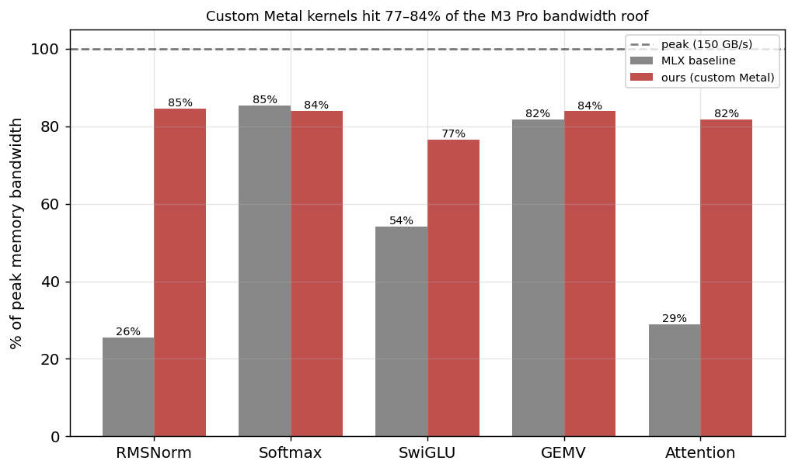

# MLX Custom Metal Kernels

Hand-written **Metal GPU kernels** for transformer ops via `mx.fast.metal_kernel`,
benchmarked against MLX's naive multi-op path and its hand-optimized builtins on
the Apple Silicon roofline.

> Project #3 of [`scaling-from-scratch`](https://github.com/jadoon200/scaling-from-scratch).
> #1 = transformer + scaling laws, #2 = quantization, #3 = the GPU code itself —
> the deepest "below the stack" rung of the [frontier-lab path](https://vladfeinberg.com/2026/05/10/how-to-land-a-job-at-a-frontier-lab.html)
> (the Flash Attention insight is a kernel-fusion insight).

## The idea

Ops like RMSNorm, softmax, and activations are **memory-bound**. In a naive
framework each runs as several separate GPU kernels — every pass re-reads and
re-writes the activations, plus per-launch overhead. **Fusing** them into one
custom kernel cuts the memory traffic and the launches, which is the entire win
for a memory-bound op. The figure of merit isn't FLOPs — it's *achieved
bandwidth as a fraction of the ~150 GB/s roof*.

## Results: four kernels



| kernel | op | ours | % peak | vs MLX baseline |
|---|---|---|---|---|
| **RMSNorm** | `x/√(mean(x²)+eps)·w` | 127 GB/s | 85% | **3.3×** over naive; = builtin |
| **Softmax** | `exp(x−max)/Σexp` | 126 GB/s | 84% | matches fused `mx.softmax` |
| **SwiGLU** | `silu(gate)·up` | 115 GB/s | 77% | **1.4×** over naive multi-op |
| **GEMV** | `W @ x` (batch=1 decode) | 126 GB/s | 84% | **1.03× — beats `mx.matmul`** |
| **Attention** | flash-style decode `softmax(qKᵀ)V` | 123 GB/s | 82% | **2.8×** over naive; **beats `mx.fast.sdpa`** |

All five are memory-bound, so the figure of merit is bandwidth vs the ~150 GB/s
roof. The custom kernels reach **77–85% of peak**, match or slightly beat MLX's
optimized builtins, and crush the naive multi-op paths — correct to ~1e-6 (fp32;
~1e-4 for the wide GEMV dot products).

Two standouts:
- **GEMV beats the general `mx.matmul`** — batch=1 decode is bound by reading the
  weight matrix once, and a dedicated GEMV has less overhead than a general matmul.
- **Fused attention beats `mx.fast.scaled_dot_product_attention`** for the decode
  case (82% vs 79% of peak) — it keeps the score vector in threadgroup (on-chip)
  memory and never writes it to global memory. That is the Flash Attention insight,
  hand-written.

## Layout

```
kernels/
  rmsnorm.py     fused RMSNorm   (threadgroup-per-row reduction)
  softmax.py     fused row softmax (two reductions: max, sum)
  swiglu.py      fused silu(gate)*up (elementwise)
  gemv.py        batch=1 matrix-vector (the decode bottleneck)
  attention.py   flash-style fused decode attention (scores stay on-chip)
config.py        chip peak specs
bench.py         correctness + speedup + achieved bandwidth, all kernels
report.py        figures + RESULTS.md
```

## Setup & usage

Reuses project #1's conda env:
```bash
conda activate mlx-transformer    # or: pip install -r requirements.txt
python kernels/rmsnorm.py         # per-kernel correctness checks
python kernels/softmax.py
python kernels/swiglu.py
python kernels/gemv.py
python kernels/attention.py
python bench.py                   # full bandwidth + speedup table
python report.py                  # figures + RESULTS.md
```

See [`report/RESULTS.md`](report/RESULTS.md) for the full writeup.

## Possible extensions
- Quantized GEMV (tie-in with project #2: read INT4 weights directly in the kernel)
- Tiled flash attention for the prefill / training regime (Tq > 1, K/V blocking)
- 2D-tiled GEMM for the compute-bound (large-batch) regime
