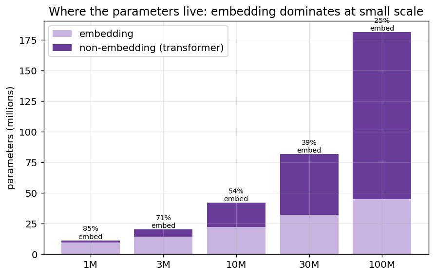
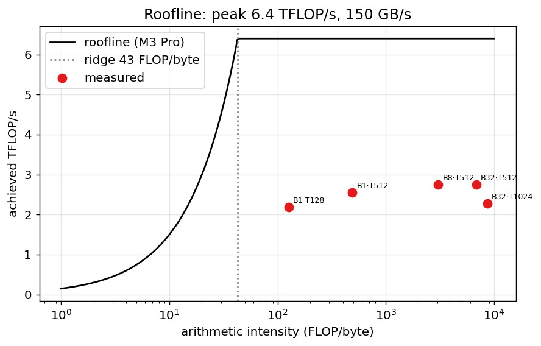
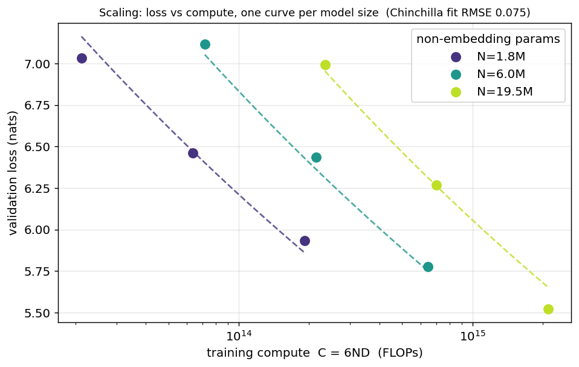
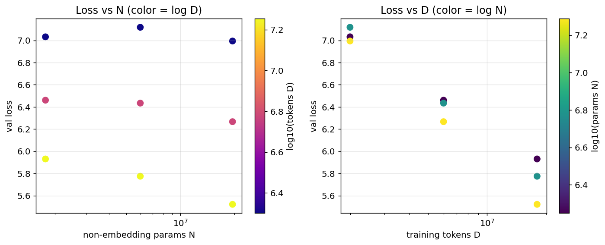
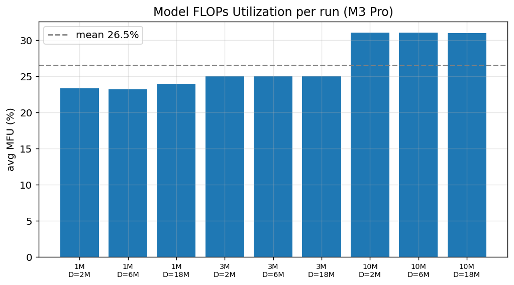

# MLX Tiny Transformer — Results

A decoder-only transformer built from scratch in Apple MLX, trained on FineWeb-Edu on an Apple M3 Pro (18 GB). This writeup focuses on the *systems* numbers — FLOPs, MFU, and empirical scaling laws — not just that the model runs.

## 1. Parameter accounting

At small scale the token-embedding table dominates the parameter budget, which is why such models are memory-bound. Scaling laws therefore track *non-embedding* parameters.



| preset | non-embedding | total | embedding % |
|---|---|---|---|
| 1M | 1.77M | 11.43M | 85% |
| 3M | 5.97M | 20.46M | 71% |
| 10M | 19.50M | 42.03M | 54% |
| 30M | 49.56M | 81.76M | 39% |
| 100M | 136.48M | 181.55M | 25% |

## 2. Roofline

Achieved throughput against the M3 Pro roofline (peak 6.4 TFLOP/s, 150 GB/s, ridge 43 FLOP/byte). Points below the sloped roof are memory-bound; the model only approaches the compute roof at large batch and sequence length.



## 3. Scaling law

Swept 9 (N, D) points and fit the Chinchilla form

```
L(N, D) = E + A / N^α + B / D^β
```

| coefficient | value |
|---|---|
| E (irreducible loss) | 0.000 |
| A | 3.68 |
| α | 0.068 |
| B | 31.1 |
| β | 0.116 |
| fit RMSE | 0.0753 nats |

Compute-optimal allocation from this fit: **N\* ∝ C^0.63**, **D\* ∝ C^0.37** (Hoffmann et al. found ≈ 0.5 / 0.5; small under-converged runs on a limited corpus shift the exponents).





## 4. Training efficiency (MFU)



Mean MFU across runs: **26.5%**. For reference GPT-3 175B trained at ~46% on A100s; small models are memory-bound and sit lower, climbing with model width and batch size.

## Reproduce

```bash
conda activate mlx-transformer
python -m data.download --tokens 50_000_000
python scaling.py --sweep --presets 1M 3M 10M --budgets 2_000_000 6_000_000 18_000_000
python report.py
```
