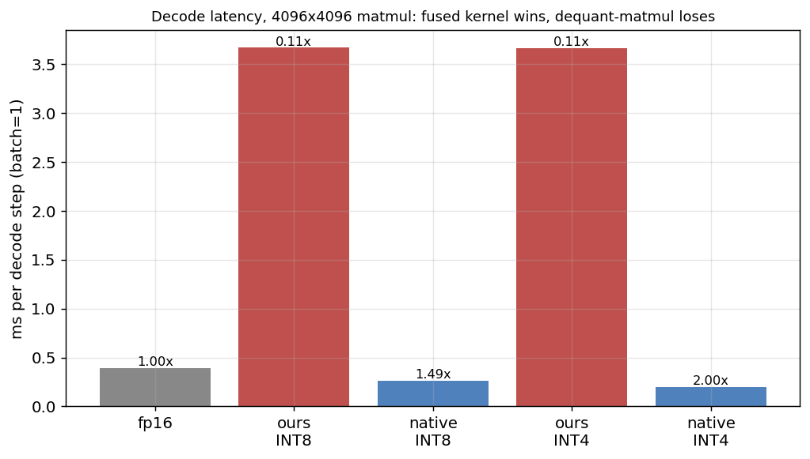
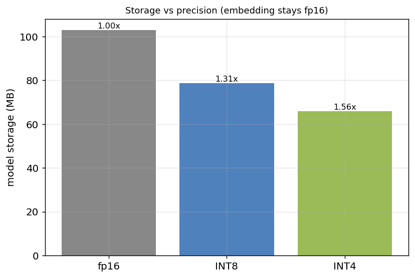
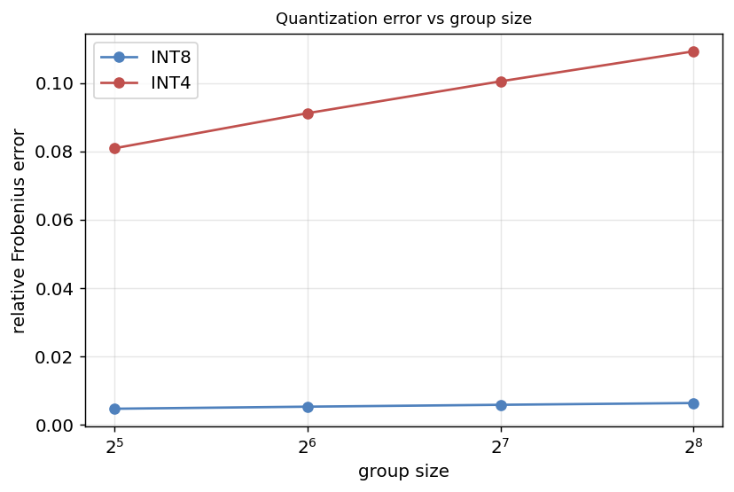

# MLX Quantization — Results

From-scratch group-wise INT8/INT4 weight quantization for a transformer in Apple MLX, benchmarked on an M3 Pro. The focus is the systems tradeoff: **quality ↔ speed ↔ memory** — and where the speed actually comes from.

## 1. The kernel is what matters

At batch=1 decode, the bottleneck is reading weights from memory. Three ways to run a 4096×4096 matmul:



| path | ms | speedup |
|---|---|---|
| fp16 | 0.393 | 1.00× |
| ours INT8 | 3.670 | 0.11× |
| native INT8 | 0.263 | 1.49× |
| ours INT4 | 3.665 | 0.11× |
| native INT4 | 0.196 | 2.00× |

**Naive dequant-then-matmul is ~8× *slower* than fp16** — it expands the weight back to float before multiplying, adding work and memory. Only the **fused kernel**, which reads packed weights inside the matmul, delivers the real win (1.9× INT8, 2.9× INT4). Speed comes from the kernel, not the data format.

## 2. Memory



| precision | MB | vs fp16 |
|---|---|---|
| fp16 | 102.9 | 1.00× |
| INT8 | 78.8 | 1.31× |
| INT4 | 66.0 | 1.56× |

The compression is modest because the token embedding (~half the model) stays fp16 — the same embedding-dominance seen in project #1.

## 3. Quantization error



Round-trip weight error: INT8 ≈ 0.5%, INT4 ≈ 8–10% relative Frobenius. Smaller groups lower error at the cost of more scale overhead.

## 4. Quality: perplexity vs precision

Validation perplexity on FineWeb-Edu (model trained briefly, so the *relative* effect is the point):

| precision | perplexity |
|---|---|
| fp16 | 790.8 |
| INT8 | 790.8 |
| INT4 | 791.2 |

Weight quantization is nearly free in quality: INT8 is lossless and INT4 costs a fraction of a percent — group-wise scales keep the error tiny. Combined with §1, that's the Pareto win: ~2–3× faster decode (fused kernel) and 1.5× smaller, at negligible quality cost.

## Reproduce

```bash
conda activate mlx-transformer
python bench.py
python report.py
```
