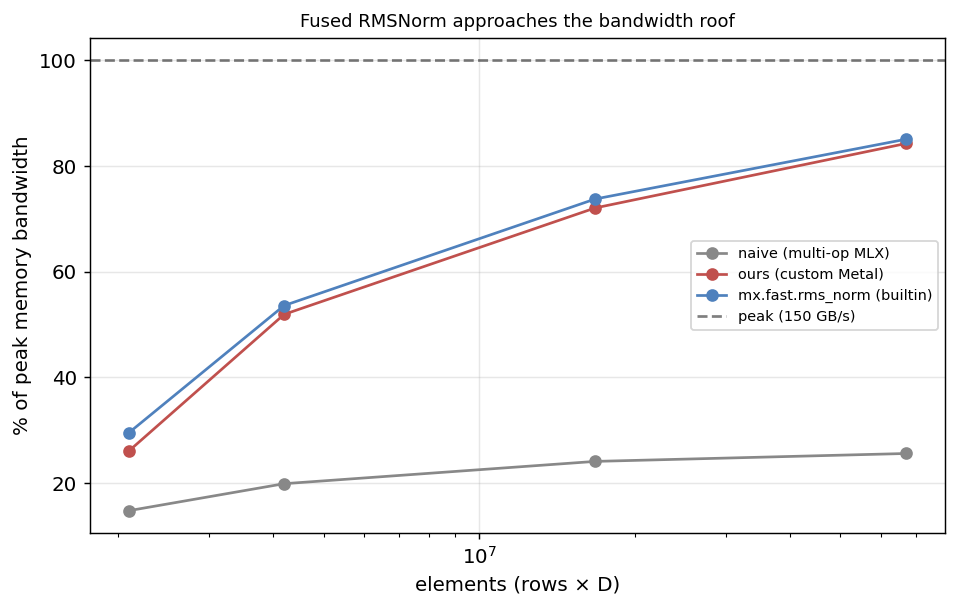
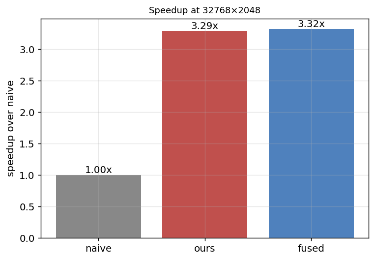

# MLX Custom Metal Kernels — Results

Hand-written Metal GPU kernels via `mx.fast.metal_kernel`, benchmarked against MLX's naive multi-op path and its hand-optimized builtin on an Apple M3 Pro (peak ~150 GB/s).

## Fused RMSNorm

RMSNorm is memory-bound. The naive pure-MLX version runs as several kernels (square, mean, rsqrt, two multiplies), each re-streaming the activations. The custom kernel fuses everything: one read of x, the sum-of-squares reduction in threadgroup memory, one write of y.





At 32768×2048 the custom kernel reaches **84% of peak bandwidth** (126 GB/s), a **3.3× speedup** over naive — matching MLX's builtin (85% of peak). Correctness vs the reference is ~1e-6 (fp32).

| size | naive GB/s | ours GB/s | builtin GB/s | ours speedup |
|---|---|---|---|---|
| 4096×512 | 22 | 39 | 44 | 1.76× |
| 4096×1024 | 30 | 78 | 80 | 2.61× |
| 8192×2048 | 36 | 108 | 111 | 2.99× |
| 32768×2048 | 38 | 126 | 128 | 3.29× |

Takeaway: for a memory-bound op the win is fewer passes over memory and fewer kernel launches. A from-scratch Metal kernel reaches the same bandwidth as the vendor-optimized builtin.

## Reproduce

```bash
conda activate mlx-transformer
python bench.py
python report.py
```
